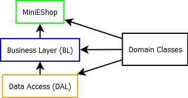
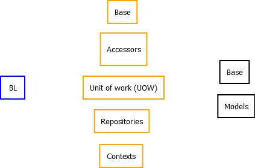

#MiniEShop
This is a simple web application showcasing the use of the MVC5 and Angular JS 1.x .
Tha data access layer has been designed as an enterprise level project.

#IDE
Microsoft Visual Studio

#Technologies
* Microsoft MVC5
* Microsoft Entity framework 6
* Google AngularJS v1.5.7
* Angular modules: ngResource, ngMessages, ui.router
* Bootstrap v3.3.6
* jquery-2.2.4
* toastr

#Architecture
<h3>Project structure</h3>

<h3>Namespace diagram</h3>

#Important files in MiniEShop project

Controllers
>Api
>>ProductsController
>>ProductTypesController

>Scripts
>>angular
>>>app
>>>filters.js

>>>services
>>>>ProductData.js
>>>>ProductTypeData.js

>>>factories
>>>>NotificationFactory.js

>>>controllers
>>>>ProductController.js
>>>>EditProductTypeController.js
>>>>EditProductController.js

#Getting started
1. Run the database script from the DB Scripts folder against your own database
2. Change the connection string in Web.config: <add name="MEDB" connectionString=...

#License
The MIT License (MIT)

Copyright (c) 2016 Productive Engine

Permission is hereby granted, free of charge, to any person obtaining a copy of this software and associated documentation files (the "Software"), to deal in the Software without restriction, including without limitation the rights to use, copy, modify, merge, publish, distribute, sublicense, and/or sell copies of the Software, and to permit persons to whom the Software is furnished to do so, subject to the following conditions:

The above copyright notice and this permission notice shall be included in all copies or substantial portions of the Software.

THE SOFTWARE IS PROVIDED "AS IS", WITHOUT WARRANTY OF ANY KIND, EXPRESS OR IMPLIED, 
INCLUDING BUT NOT LIMITED TO THE WARRANTIES OF MERCHANTABILITY, 
FITNESS FOR A PARTICULAR PURPOSE AND NONINFRINGEMENT. IN NO EVENT SHALL THE AUTHORS OR COPYRIGHT HOLDERS BE LIABLE FOR ANY CLAIM, 
DAMAGES OR OTHER LIABILITY, WHETHER IN AN ACTION OF CONTRACT, TORT OR OTHERWISE, ARISING FROM, OUT OF OR IN
CONNECTION WITH THE SOFTWARE OR THE USE OR OTHER DEALINGS IN THE SOFTWARE.
